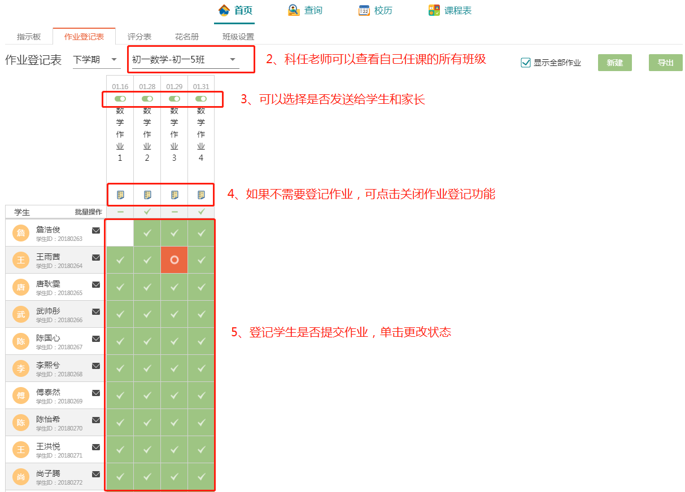

#                        教师端帮助手册

**首页**是教师进行教学活动的主要页面，教师的备课，作业批改，设置考试，成绩登记等主要教学内容都在这个页面完成。在**查询**页面，教师可以迅速地查看学生和学生家长的信息。**校历**则为教师提供了一个简洁且一目了然的教学时间安排表。最后，在**课程表**部分，教师除了自己直观的课表外，可以根据自己的实际需求去查看不同年级，不同班级，不同课程班的课表。

## 1、首页信息

### 1.1 指示板内容

指示板主要分为四个部分：年级教学目标面板，教学安排和资源查看面板，我的信息面板以及教学安排轴

指示板主要呈现与教学任务相关的一些信息，教师**备课、查看教学任务，以及管理教学进度**都可以在指示板部分寻找到相关的功能。教师可以在指示板部分寻找或上传教学资源，收发消息与学生进行沟通。教师也可以通过教学安排轴对教学任务有整体的认识，把握教学节奏。 

**年级教学目标面板**，**教学安排和资源查看面板**主要是让教师对备课组制定的教学计划，教学目标有更好了解，同时能更好地促进整个教学组的教学资源共享。

**我的信息面板**则可以使教师便捷地收发与学生和家长的信息

**教学安排轴**则可以直观地展示当前教学任务的执行情况，方便教师及时调整教学安排

#### 1.1.1 教学目标面板

系统根据备课组长的编辑显示当前科任老师的教学目标，点击教学目标面板**查看教学目标**详情

#### 1.1.2 查看教学安排和资源

教学安排和资源面板总共可分为四部分：

a 课程资源查看与添加，b 教学计划和安排，c 试题，d 查看更多章节

###### a、点击可查看或章节的共享课程资源

  1）点击具体小节添加课程资源

2）点击按章添加或查看课程资源

###### b、在这部分显示课程的总课时和考试等信息，点击可查看备课组详细的教学计划和安排，包括单元数，总课时数，考试次数以及每周教学任务

###### c、【试题】上传

教师可按照单元考，月考，期中考试，期末考试等考试类型上传试卷 

###### d、查看或添加所有章节的资源

#### 1.1.3 信息面板

敬请期待，正在开发

#### 1.1.4 教学安排轴

教学安排轴可以直观地展示整个教学的进度，教师可以通过教学安排轴来安排自己的教学活动和把握教学进度。

### 1.2 作业登记表

作业登记表则是教师在**收集作业**时会使用的功能，教师可以通过作业登记表可以**对学生交作业的情况进行登记**，并启动自动通知学生和家长的功能，系统会自动发送学生作业情况给学生和家长。 

### 1.3 评分表

评分表为教师提供快捷的登分入口，教师能快速地为学生的每次作业和考试进行登记。评分表还可以查看学生期末综合成绩的各部分构成的比重和学生本学期的成绩表现，教师可以在这里查看和分析学生成绩，为学生针对某次考试撰写评价和总评。

#### 1.3.1新建评分表，在弹出的弹窗设置评分表信息

点击【新建】，在弹出的弹窗设置评分表信息，然后选择【类型】等信息，点击【保存】即可建立新的评分表。 

#### 1.3.2评分表的其他功能

#### 1.3.3  班级成绩数据分析

在这部分会对班级成绩有大概的展示，教师可以在这部分观看班级的成绩分布情况。

### 1.4 花名册的使用

### 1.5 班级设置

## 2、查询

## 3、查看校历

重要的事件、节假日都在日历上用色块标识出来，方便教师直接观看。

## 4、课程表

在这部分，教师不仅可以查看我的课表，还可以按行政班或者课程班为单位看到全校的课表，根据学生姓名或者教室名称可进行课表查询。

### 4.1 我的课表

### 4.2 行政班课表

### 4.3 课程班课表

### 4.4 课表查询

输入学生姓名，教室名即可搜索。

